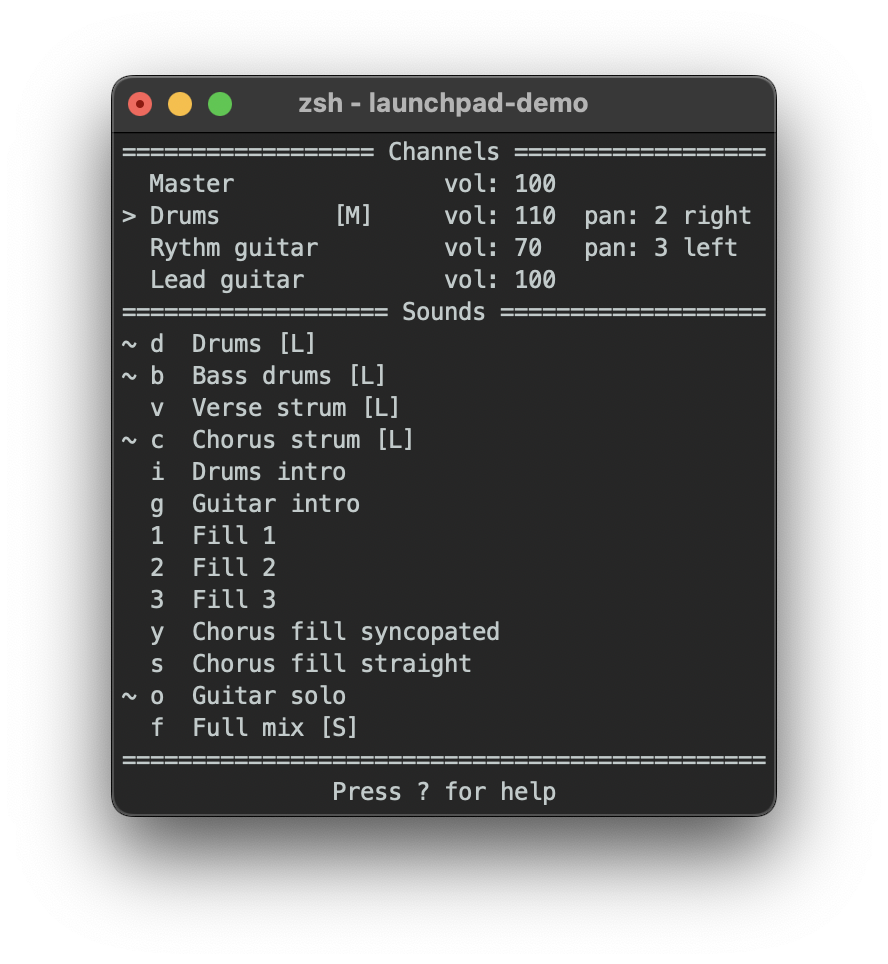

# FMOD Launchpad

A terminal-based sound player built using the FMOD Core API.

The project consists of a library and an executable demo that includes audio assets and a TUI (Text-based UI) to interact with the system.

Developed as a final project of the *Sound Programming* course for the Master in Computer Game Development.

## Library

[`launchpad`](launchpad) is a static library that wraps FMOD's low-level Core API in a more accessible interface,
resembling the behavior of a Launchpad or a general audio player:
- Support for single-shot and looping audio tracks
- Control over multiple audio channels, with individual volume, mute, panning, and play/pause states

The library handles the lifetime of FMOD primitive objects internally,
wrapping them in RAII-style classes that provide safe allocation and release.

## Demo

[`launchpad-demo`](launchpad-demo) is a standalone executable that links against `liblaunchpad` and allows to interact with their objects.
Interaction happen via the terminal, in the form of a TUI,
designed for performing operations quickly,
like playing multiple tracks at the same time.

It comes bundled with a collection of audio samples you can mix and match in real-time to recreate a cover of
[Dreams by Fleetwood Mac](https://www.youtube.com/watch?v=PgagPdVM7bk&list=RDPgagPdVM7bk&start_radio=1).

Interaction is keyboard-based:
- Commands use capital letters (Shift + Key)
- Sounds are assigned a specific key and can be triggered with a single key press
- Press `?` at any time to see the full list of commands and controls

### FAQ

#### **How do I quit? I've been stuck in my terminal for two days!**
I'm glad you asked, it's always important to tell people how to quit your program:
just press `Q` (that's **Shift + Q**).
Thank me later.

## How to Build and Run

Compiled binaries are provided in the Releases section for Windows and macOS,
however if you want to build the project yourself you can:
1. Open `fmod-launchpad.sln` in Visual Studio and Run with the Release configuration
2. Run `make` on macOS from `launchpad-demo/`

## Credits

- Music: myself and my guitar
- Original song: Dreams – Rumours by Fleetwood Mac
